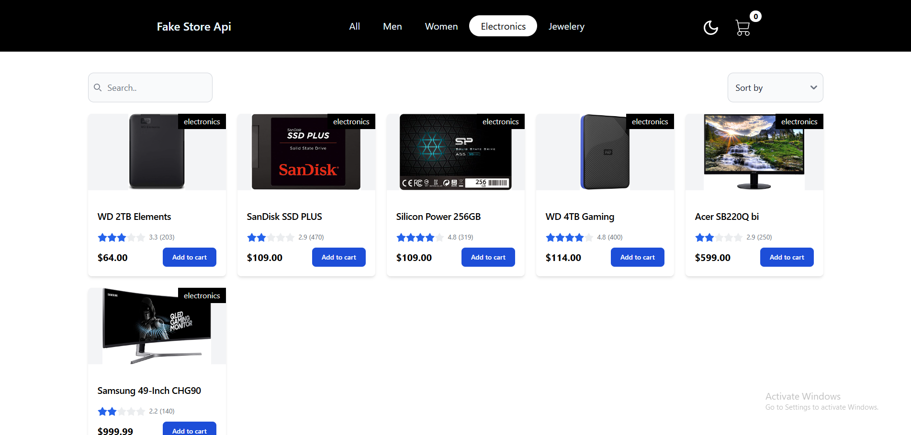
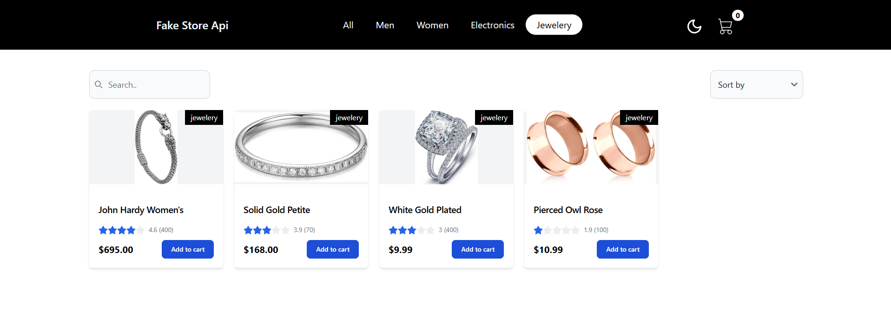
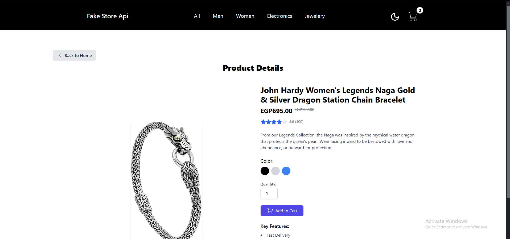
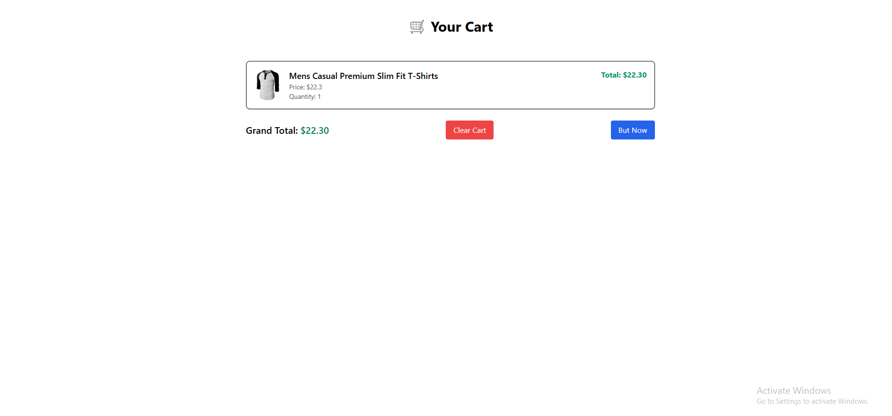
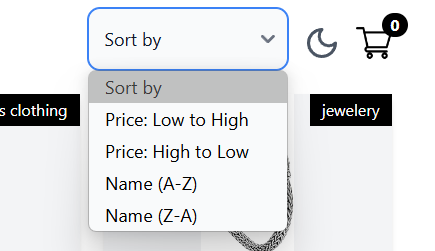
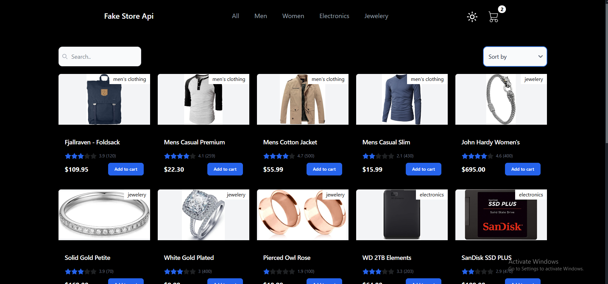
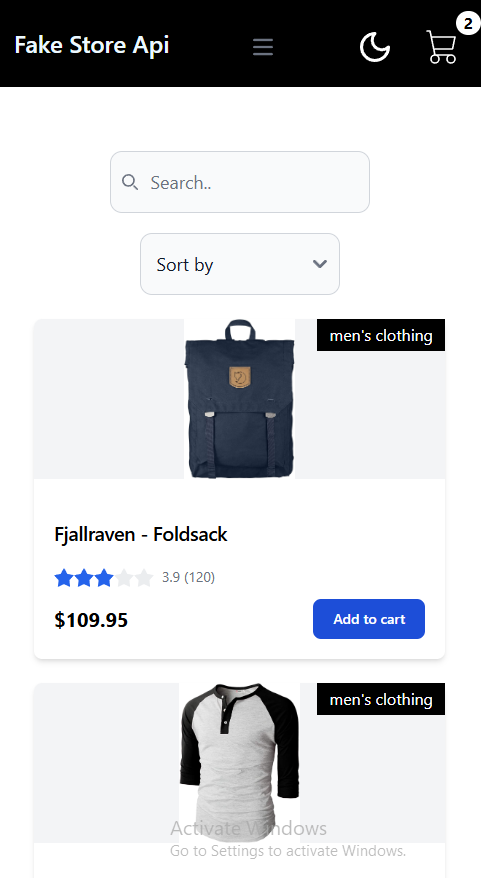
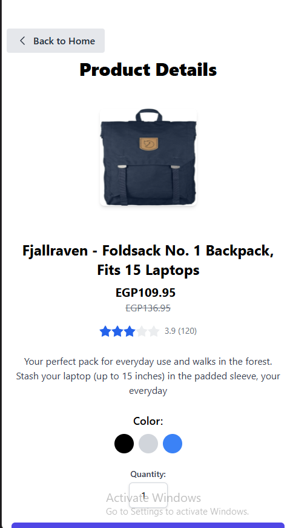
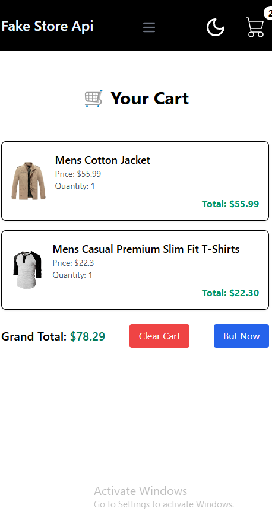

# 🏔️ Product Gallery Web App

> A modern, responsive shopping cart demo built with Angular and TailwindCSS.

---

## 🚀 Overview

This is a showcase Angular application featuring a beautiful UI, smooth user experience, and robust code structure. It demonstrates best practices in Angular development, state management, and UI design using TailwindCSS.

---

## 🌐 Live Demo

Check out the app live at: [tech-summit-task.vercel.app](https://tech-summit-task.vercel.app)

---

## ✨ Features

- Product listing and details
- Add to cart and cart management
- Sorting and searching products
- Category Based Sorting
- Responsive design (mobile & desktop)
- Dark mode toggle
- Modern header and navigation

---

## 🛠️ Tech Stack

- **Angular** 19.2.15 — SPA framework
- **TailwindCSS** — Utility-first CSS for rapid UI development
- **RxJS** — Reactive programming
- **Angular Router** — Client-side routing
- **Flowbite** — UI components for TailwindCSS

### 📦 Libraries Used

- `tailwindcss`, `flowbite`
- `rxjs`

---

## 📸 Screenshots

<div align="center">
  
  
  
  
  
  
  
  
</div>

---

## 📱 Mobile Experience

<div align="center">
  
  
  
</div>

---

## ⚡ Getting Started

Clone the repo and install dependencies:

```bash
git clone https://github.com/moatazmohaamed/tech-summit-task.git
cd summit-task
npm install
```

Start the development server:

```bash
ng serve
```

Visit [http://localhost:4200](http://localhost:4200) in your browser.

---

## 🧩 Code Structure

- `src/app/pages/products` — Product listing & details
- `src/app/shared/components` — Reusable UI components
- `src/app/shared/pipes` — Custom pipes (sorting)
- `src/app/core/services` — API & business logic

---
